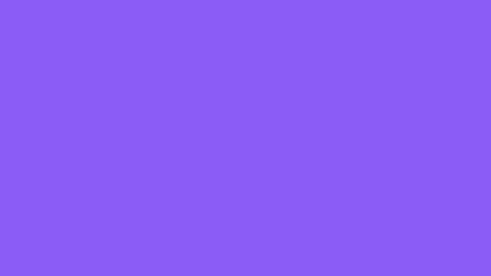

# Annotator: Label Rows

Once a project is open, annotators label rows one at a time.

## Starting

Open a project and click **Label**. The app fetches the **next unannotated row** for you — rows are served in a deterministic per-user shuffled order, so each annotator sees a stable but personalized sequence.

## The label view

Each row renders the project template with the dataset row's fields. You interact with the template's widgets to fill in the annotation, then submit.

## Navigation

- **Next row** — move to the next unannotated row.
- **Previous / next** within a row's ordering — move through the shuffled sequence.
- **Next-row endpoint** — the app always asks for the next unannotated row; if all rows are annotated, you'll be told so.

## Submitting

Annotations are stored per `(project, row, user)`. Re-submitting the same row **updates** the existing annotation rather than duplicating it. Each annotation is timestamped with created/updated times.

## Progress

The project detail shows progress:

- **Annotated rows** — distinct rows annotated by anyone.
- **Annotated by me** — distinct rows you have annotated.
- **Total annotations** — count of annotation records.

## Screenshot

> **Screenshot needed:** capture the label view — a row with the rendered template widgets and the submit button.

