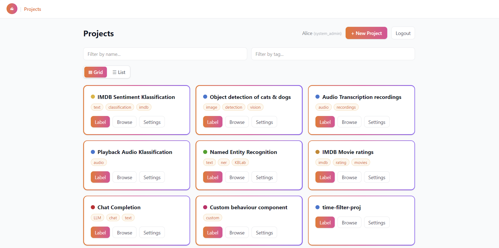

# fyndnot User Guide

fyndnot is a general-purpose **ML dataset annotation tool**. It loads datasets, defines labeling UIs via React templates rendered in `react-live`, and collects annotations from annotators.

## Workflows

- **[Create a Project](/guide/create-project)** — load a dataset, pick a template, configure, and create.
- **[Label Rows](/guide/annotating)** — open a project and annotate rows one at a time.
- **[Browse & Filter](/guide/browsing)** — page through rows and filter by data, annotation, or metadata.
- **[Widgets & Templates](/guide/widgets)** — the building blocks that make up a labeling UI.
- **[AI Prefill](/guide/ai-prefill)** — optional AI-suggested annotations.
- **[Export](/guide/export)** — export annotations as Parquet.

## Roles

- **[Roles & Permissions](/guide/roles)** — what each role can do.

## API

The full REST API is documented in the [API Overview](/api/) and the [Interactive Swagger](/api/swagger).

## Screenshots

> **Project overview:** a screenshot of the main product UI here.

## End-to-end flow

An annotation project moves through a fixed sequence — from dataset to export. Each step builds on the one before it.

1. **Login and open the app**
   Login as an admin or annotator. Admins can create projects; annotators see the projects they have permission to open.

2. **Load a dataset**
   Download or select a dataset to be annotated. Sources include Hugging Face, HTTP URLs, local files, or a direct browser upload.

3. **Pick or edit a template**
   Choose a labeling template (or edit one). Templates define which widgets annotators will use and are previewed live before saving.

4. **Configure and create the project**
   Add metadata and settings — name, color, tags, instructions — and optionally enable AI auto-annotations. Then create the project.

5. **Annotators label rows**
   Annotators open the project and label rows one at a time using the template's widgets.

6. **Submit annotations**
   Each labeled row is submitted and stored per `(project, row, user)`. Re-submitting a row updates the existing annotation.

7. **Browse and filter rows**
   Explore the dataset, see annotation status, and use filters to find what still needs to be labeled.

8. **Export as Parquet**
   Download the annotated dataset as Parquet to analyze the results and gain insights.
