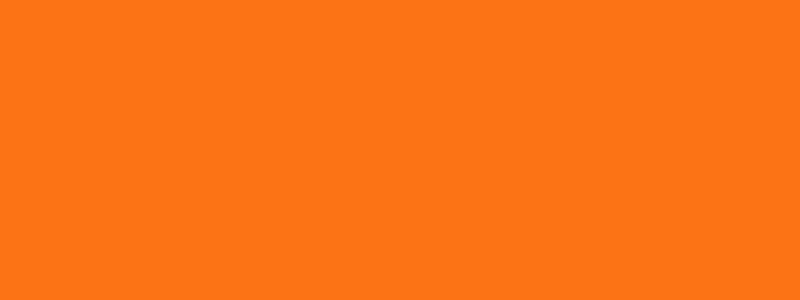
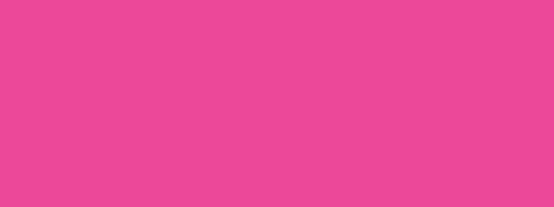

# Widgets & Templates

Templates are restricted React component source rendered in a `react-live` sandbox. Widgets are the building blocks annotators interact with. Each widget has a `name` used as the annotation field key.

## Core annotation widgets

| Widget | Field type | Purpose |
|--------|-----------|---------|
| `SelectField` | single choice | Pick one option from a list. |
| `TextField` | free text | Enter text. |
| `CheckboxGroup` | multi-choice | Select multiple options. |
| `RatingField` | numeric rating | Rate on a scale. |
| `NERField` | token spans | Named-entity / span annotation. |
| `BBoxField` | bounding box | Image bounding-box annotation. |

## Media widgets

| Widget | Purpose |
|--------|---------|
| `AudioPlayer` | Play an audio sample. |
| `AudioSegmentField` | Annotate audio segments. |

## Template example

```tsx
<div>
  <h3>{text}</h3>
  <SelectField name="sentiment" options="positive,negative,neutral" />
</div>
```

## How it works

1. The template source references dataset fields (e.g. `{text}`) and widgets.
2. `react-live` compiles and renders it live in the sandbox.
3. Widgets register their state so the app collects their values into the annotation `data` object.
4. The submitted annotation is stored as JSON keyed by widget `name`.

## Validation

Templates can be flagged `validated` when they are known-good. The setup view can group templates by modality and preview them live before saving.

## Screenshots

> **Screenshot needed:** capture a couple of rendered widgets — a `SelectField`, a `BBoxField`, and a `NERField` example.



