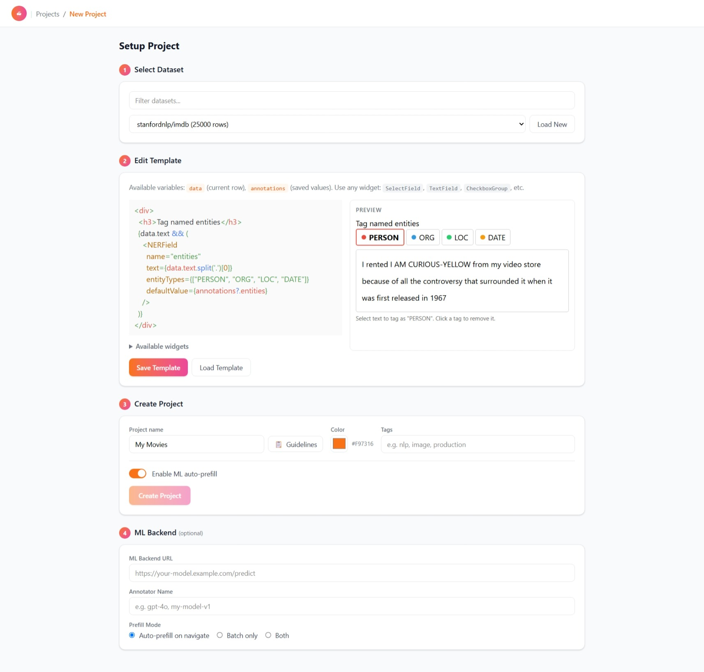
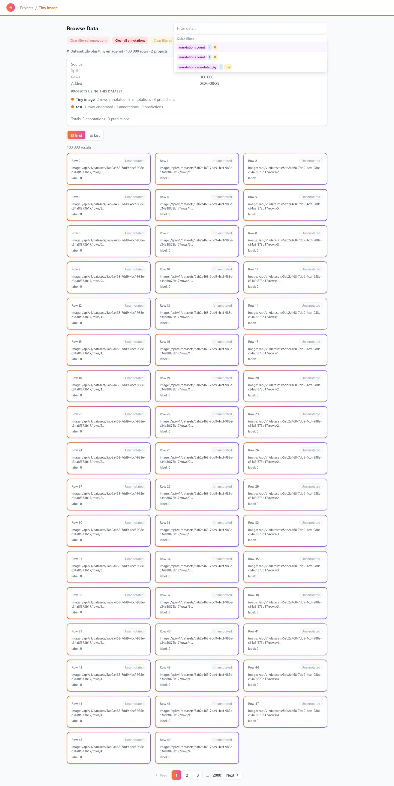

## Goal

fyndnot turns any dataset into an annotation project: load your data, define the
labeling UI from reusable widgets with a live preview, collect annotations from
annotators, and export labeled rows as Parquet — without writing frontend code.

## How a project flows

An annotation project moves through a fixed sequence:

1. **Load a dataset** — Hugging Face, HTTP URL, local file, or browser upload.
2. **Pick or edit a template** — the labeling UI, previewed live before saving.
3. **Create the project** — name, color, tags, instructions; optionally enable AI prefill.
4. **Label rows** — annotators work through the dataset one row at a time.
5. **Browse & filter** — check progress and filter by data, annotation, or metadata.
6. **Export as Parquet** — download the annotated dataset.

Full walkthrough: [User Guide](/guide/).

## Screenshots

<figure>
  
  <figcaption>Admin creates a project</figcaption>
</figure>

<figure>
  
  <figcaption>Annotator labels rows</figcaption>
</figure>

<figure>
  
  <figcaption>Review &amp; filter results</figcaption>
</figure>

## Quick start

1. **Sign in** — SSO (or the seeded dev users).
2. **New Project** — admins load a dataset and pick a template with live preview.
3. **Load a dataset** — e.g. `stanfordnlp/imdb`, then create the project and start labeling.

[Docker installation](/install) · [Create your first project](/guide/create-project)
